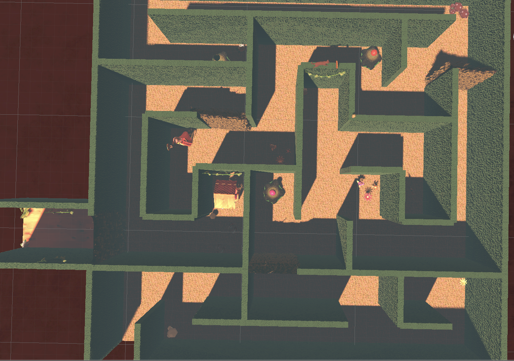
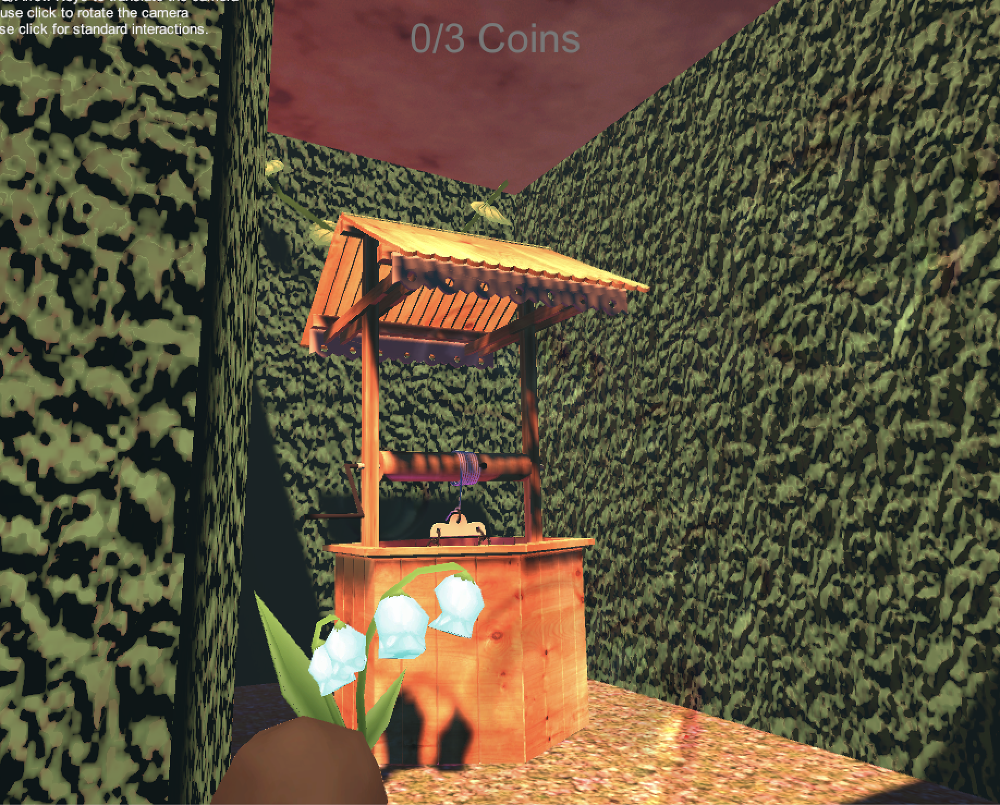
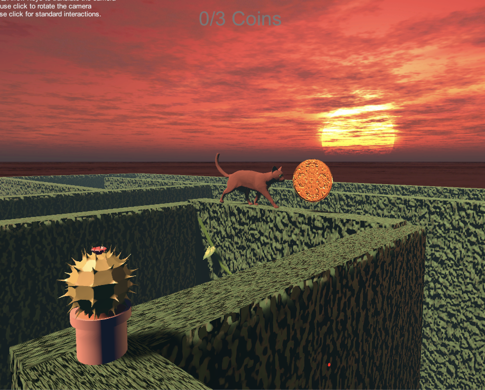
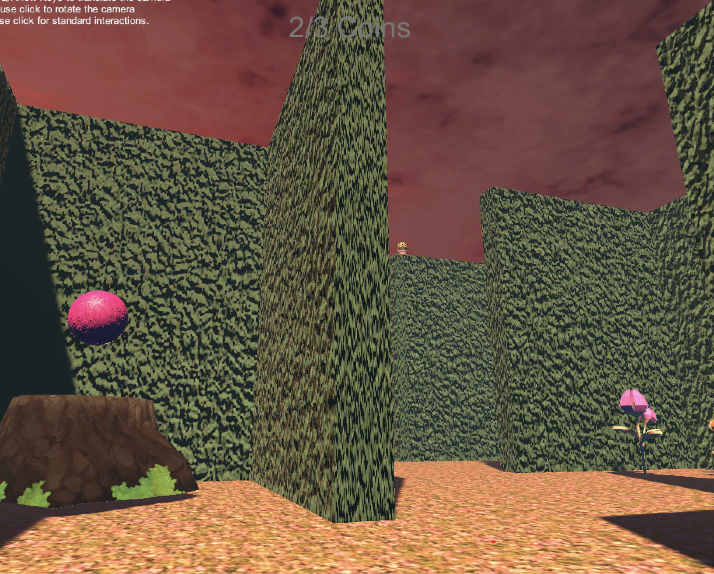

# 01-maze-audiocode-smeerws

### Project description: 
Man befindet sich an einem Frühling Abend in einem Irrgarten, indem sich ein Wunschbrunnen befindet soll. Um sich jedoch etwas wünschen zu dürfen benötigt man 3 Goldmünzen, die man im Spielverlauf erst finden und einsammeln muss. Die erste Münze findet man nur per Sound. Die zweite Münze befindet sich in den Pfoten einer schwarzen hungrigen Katze, die die Münze nur durch tauschen rüberwachsen lässt. Die letzte Münze bekommt man, indem man das Rätsel eines Zauberes löst. Durch lösen verschiedener Aufgaben gelingt es einem am Ende einen Wunsch zu machen und aus dem Labyrinth zu entkommen.  Mit den Coins geht jeweils eine geheime Tür im Irrgarten auf und der Spielraum erweitert sich.

### Development platform: 
OS: MacOS Big Sur M1 Chip, Game Engine: Unity 2019.1.14f1, Visual Studio 2019, Steam,  
SteamVR 2.5.0 (https://github.com/ValveSoftware/steamvr_unity_plugin/releases/tag/2.5.0)

Note on Unity Version 2019.1.14f1 and SteamVR: The SteamVr plugin has many issues when used with Unity Versions > 2019.1.3 because the XR Management System changed from 2019.1.3 to 2019.1.4. Valve is working on it, so we will use these older versions for the VR programming.  
Download steamvr_2_5_08_19.unitypackage, import the package: Assets --> Import Package --> Custome Package

## Software/Hardware Requirements: 
Unity hardware requirements https://docs.unity3d.com/2019.1/Documentation/Manual/system-requirements.html 
Oculus hardware requirements https://support.oculus.com/248749509016567/
Steam has to be installed
SteamVR has to be installed
You need a VR headset in this case an Oculus Rift

First open Oculus software, second open SteamVR (or start game from unity), otherwise some strange errors will happen. 

### Target platform: 
Oculus Rift/S, Vive; 
Tested on Oculus Rift S

### Visuals: 

Video Proof of Gameplay: https://we.tl/t-2SYAnm23HB

### Third party material: 
-Graphics and Materials from Unity Asset Store

### Project state: 
98%/100% finished
<progress max="100" value="2"></progress>

### Limitations: 

### Lessons Learned: 
-onTrigger enter commands
-Audiosource workflow

Copyright by inner-e
